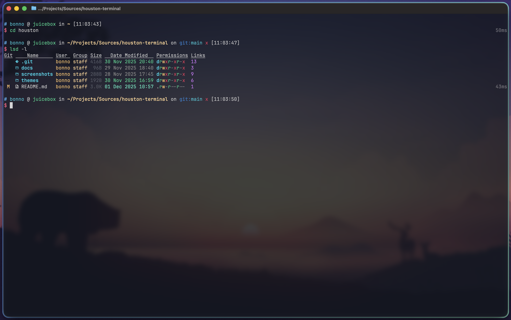

<div align="center">
  
  <h1>houston-terminal</h1>
  <p>A collection of terminal color profiles inspired by the <a href="https://github.com/withastro/houston-vscode">Houston VSCode theme</a>.</p>
</div>

> [!NOTE]
> Want to help out by creating a terminal color profile for your terminal emulator of choice? Check out the [color reference table](docs/color-reference.md) in the documentation to speed up the process!

## Installation
### [Ghostty](https://ghostty.org/)


#### Instructions
> [!IMPORTANT]
> _You may need to create the `~/.config/ghostty/` folder if you haven't already done so_

1. Download the [`themes/config`](./themes/config) file.
1. Open Ghostty and click on `Settings`. This should open the configuration file in your default text editor.
2. If you haven't previously customized Ghostty the file should be empty and you can proceed to step 3. If the file is not empty copy the contents of the file so that you can restore your configuration after completing step 3.
3. Exit Ghostty and _navigate to the directory you downloaded the config file to_ and run the command below:

    ```sh
    cp config ~/.config/ghostty/config
    ```
4. (Optional) Open `~/.config/ghostty/config` with your favorite editor and paste the configuration you've copied in step 2 into the file. Just make sure you do not paste back any of the `palette` keys or the `foreground` and `background` keys.

### [iTerm2](https://iterm2.com/)


#### Instructions
1. Download the [`themes/Houston.itermcolors`](./themes/Houston.itermcolors) file.
2. Open the preferences window in Iterm2. Under `Profiles -> Colors`, open the `Color Presets...` dropdown in the bottom right and select import.
3. After importing, you can set Houston as your theme from the same dropdown.

    ||
    |:-:|
    |*Importing iTerm2 theme*|

### [Warp](https://www.warp.dev/)


#### Instructions
> [!IMPORTANT]
> _You may need to create the `~/.warp/themes/` folder if you haven't already done so_

1. Download the [`themes/houston.yaml`](./themes/houston.yaml) file.
2. _Navigate to the directory you downloaded the yaml file to_ and run the command below:

    ```sh
    cp houston.yaml ~/.warp/themes/
    ```
3. Restart Warp.
4. Navigate to **Settings → Appearance → Theme** and search for `Houston`.
5. Select the theme and click the check mark in the bottom left.

    ||
    |:-:|
    |*Setting the theme in Warp*|

### Windows Terminal


#### Instructions
1. Open the `themes/windows-terminal.json` file and copy the JSON object.
2. In Windows Terminal, go to Settings and click `Open JSON File` in the bottom left.

    ||
    |:-:|
    |*Configuring the color scheme in Windows Terminal*|

3. Paste the JSON object from step 1 into the `schemes` array of the JSON configuration file.
4. The Houston theme will now show up in the `Color schemes` section of Settings and is available to use on all of your terminal profiles.
